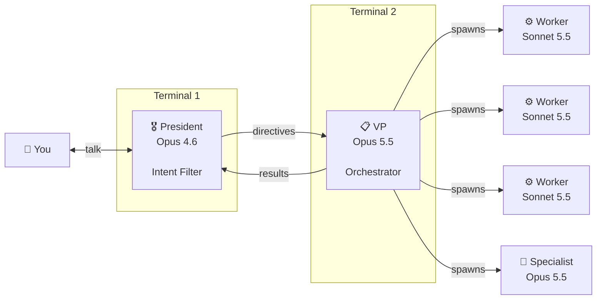

# fully-aligned

Battle-tested [Claude Code](https://claude.com/claude-code) skills for keeping multi-agent teams aligned with user intent.

## The problem

Newer, more capable models are better at tool-calling and managing complexity — but they also editorialize, inject their own priorities, and self-authorize actions you didn't ask for. An agent that runs 32 minutes deaf to 11 queued corrections isn't capable; it's dangerous.

These skills solve this by **separating intent from execution** across a structured chain of command.

## What's in the box

### `chain-of-command`

A multi-session architecture that splits work across three tiers:

| Role | Model | Job |
|------|-------|-----|
| **President** | Opus 4.6 | Understand user intent. Translate into directives. No tools, no code. |
| **VP** | Opus 5.5 | Receive directives. Plan and orchestrate execution. Manage the team. |
| **Workers** | Sonnet 5.5 | General implementation — the bulk of the work. |
| **Specialists** | Opus 5.5 | Deep analysis, reverse engineering, complex debugging. |



The President never touches files. The VP never talks to you directly. Workers never talk to you or the President. Intent flows down cleanly; results flow back up.

Includes documented failure modes and fixes: VP self-authorization, correction pushback, context burn, chain bypass, and context exhaustion cascades.

### `team-lead`

The operational playbook for running parallel Claude Code teammates. The VP loads this skill to manage its workers. Covers:

- **The 15-minute wall clock** — teammates must end their turn every 15 minutes or get killed and replaced. Messages only arrive between turns, so a lane that never stops can't be corrected.
- **Worktree isolation** — one git worktree per lane, no shared mutable state.
- **Shared task list** — TaskCreate/TaskUpdate as the source of truth, not messages.
- **Message hygiene** — stale notification handling, one message per check-in, no acks or noise.
- **Context budget** — kill a lane at ~750k tokens before compaction hits mid-task.
- **The brief template** — 10-item checklist that makes every teammate self-sufficient.

## Install

Copy the skill files into your Claude Code skills directory:

```bash
# Global install (all projects)
cp skills/chain-of-command.md ~/.claude/skills/
cp skills/team-lead.md ~/.claude/skills/

# Project-specific install
cp skills/chain-of-command.md your-project/.claude/skills/
cp skills/team-lead.md your-project/.claude/skills/
```

## Quick start

1. Open two Claude Code terminals.
2. Terminal 1: `/name president` → `/model` → select **Opus 4.6**.
3. Terminal 2: `/name vp` → `/model` → select **Opus 5.5**.
4. Brief both sessions (starter prompts are in the skill files).
5. Give your instruction to the President. It translates and relays to the VP. The VP spins up teammates and manages execution.

## Requirements

- [Claude Code](https://claude.com/claude-code) with agent teams enabled
- Add to `~/.claude/settings.json`:
  ```json
  {
    "env": {
      "CLAUDE_CODE_EXPERIMENTAL_AGENT_TEAMS": "1"
    },
    "crossSessionInbound": "auto"
  }
  ```
- Enough RAM for the team (~2 GB per teammate + 10% buffer)

## Why Opus 4.6 as President?

Opus 4.6 is the last Claude model on the older tokenizer. It's worse at tool-calling and can't handle large repos — but it's the most faithful to user intent. It doesn't inject its own agenda. It spends its effort understanding what you mean, not what it thinks you should mean. That makes it the perfect filter between you and the models that do the heavy lifting.

## License

[MIT](LICENSE)
